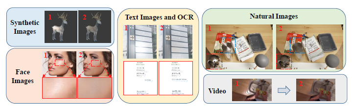

# M2-Net

This repository is the official implementation of [M2-Net: Multi-stages Specular Highlight Detection and Removal in Multi-scenes](https://arxiv.org/abs/2207.09965). 

>```
>@article{huang2022m2,
>title={M2-Net: Multi-stages Specular Highlight Detection and Removal in Multi-scenes},
>author={Huang, Zhaoyangfan and Hu, Kun and Wang, Xingjun},
>journal={arXiv preprint arXiv:2207.09965},
>year={2022}
>}
>```

## Introduction

**M2-Net** (the name Multi-stages Specular Highlight Detection and Removal in Multi-scenes) achieves strong performance  in multi-scenes single image specular highlight removal (natural scenes, facial scenes, text scenes etc.), surpassing previous models by a large margin.




## Requirements

To install requirements:

```setup
pip install -r requirements.txt
```


## Training

To train the model(s) in the paper, run this command:

```train
python train.py --runs_name <> --dataroot <> --train_dir <> --test_dir <>
```

Example:

```
python train.py --runs_name './myruns' --dataroot './data/shiq' --train_dir 'train' --test_dir 'test'
```

## Evaluation

To evaluate my model on your datasets, run:

```eval
python infer.py --input_dir <> --output_dir <> -- infer_model <>
```

Example:

```eval
python infer.py --input_dir './test/inp/' --output_dir './test/out/' -- infer_model './savedmodel/nature.mdl'
```

## Pre-trained Models

You can download pretrained models here [M2Net](https://drive.google.com/file/d/1gY4gNfbLuvSjIgMOyeVlrY0OCJt9mZzm/view?usp=sharing) , It contains two models( text_face and nature), you can use either one according to your needs.

## Final Note

This code is not allowed for any commercial purpose without written concent from the authors.
